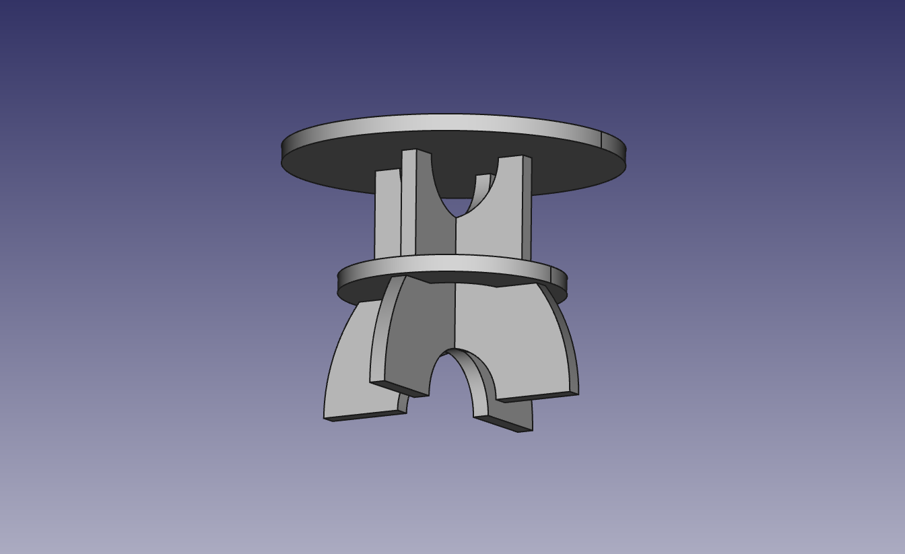

# 3d-mesa-centro

Esta mesa de centro está composta por 4 pezas simples en madeira de 3cm de
grosor buscando un ensamble rápido e construción robusta.

- [src](src) Documentos fonte.

## Despece

## Montaxe

### Encaixe de patas

### Reforzo coa tabla do medio

### Posta da tabla superior

