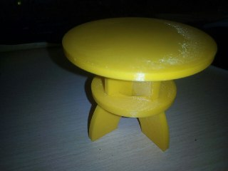

# Deseño de mesa de centro

Esta mesa de centro está composta por 4 pezas simples en madeira de 3cm de
grosor buscando un ensamble rápido e construción robusta.

## Recursos

- [src - Documentos fonte](src).
- [stl - Sólidos CAD](stl).

## Despece

## Montaxe

### Encaixe de patas

### Reforzo coa tabla do medio

### Posta da tabla superior

## Prototipo impreso a 1:6

